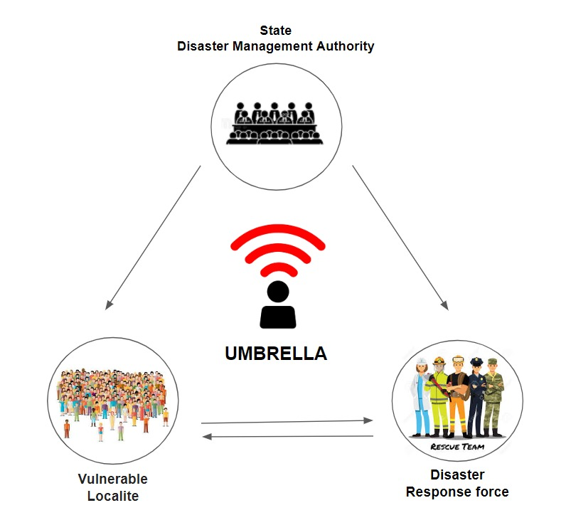

# UMBRELLA

Project umbrella aims to connect the localites with the response force and the state disaster management authority for reliable and efficient communication and coordination among them.This is done by creating different applications for the three different users.By using IBM watson ,Firebase and a couple of third party API services we can build a information rich Interface for the localite.This can be then connected with the response force application.With the information collected from the meteorological department and other trusted sources we give risk predictions to the disaster management authority their decisions can now be communicated with the emergency response force and the localites at ease using push notifications.

[Project Repository](https://github.com/Ramki1999/project-umbrella/)

## Sendai Framework -
The Sendai Framework for Disaster Risk Reduction 2015-2030 (Sendai Framework) was the first major agreement of the post-2015 development agenda and provides Member States with concrete actions to protect development gains from the risk of disaster.
It has the following 7 key goals :

Keeping this as the key goal the project umbrella builds a reliable connection between the three set of people for coordinated work using the modern and best use of technology

### Technology used -

Making the best use of cloud services to build the system architecture and connect the three applications with synchronized data connection among them,yet scaling asynchronously.Since the architechture is easy and very connected with the three applications it can scale globally.

### Umbrella user app -

The Umbrella user app is built on flutter to give native android and ios apps.It is rich of information and feature to ensure amazing user experience.The app gives location based weather data and predictions using the open weather map api.It uses Watson assistant to create a chatbot to answer users questions and navigate them to the relief centers.The app uses firebase cloud messaging to give alert notifications to the user during emergency and disaster times declared by the Disaster management authority.It also engages them with community cooperation by making donations to the people affected due to these disasters.It gives news feed about weather changes and disaster updates. It also has a SOS button and contact details to connect you to the local rescue force incase of emergency.This can make the rescue team to respond faster as we have the location details of the affected user.

### Umbrella response app - 

The Umbrella response app is also built on flutter but has only two functionality, 
1. To receive  emergency calls and messages from the affected people.
2. To receive  instructions from the disaster management authority and respond according to their emergency decisions.
The app also allows the response  team to connect among themselves and coordinate accordingly.

### Umbrella DMA web app -
 
 The Umbrella DMA is a web app that shows the dashboard of necessary information. The disaster management chairperson can register and give access to other authority members.They receive  the states meteorological data and can take coordinated emergency decisions.Their decisions can be communicated to the Umbrella response app to make faster emergency responses in certain places.Also they can send emergency alert notifications to the disaster prone umbrella users based on their locations. 
 
### Server - 

Considering the scalability and authentication criteria, as we are working on multiple connections simultaneously the app will be built on node.js It collects the meteorological data and shows it to the Umbrella DMA app and Response app.The server also takes care of the connection between the applications using websockets.This server sends alert data to the push notifications which pushes the  messages to the localite user app and response force app. 

## Conclusion

Since the architecture of interconnected applications is asynchronous and tree like user flow.It can be scaled nationaly and hence globally.
On complete establishment of the umbrella apps, there are many possible features that project umbrella could bring in like
1. Can provide off grid communication when mobile networks and internet goes off, using the network infrastructure that is implemented by 2018 Call for code winners, PROJECT OWL.
2. Accountability of material damage and public loss at ease.
3. Distribution and accountability of relief funds can be made with the umbrella app.
4. Encourage Community cooperation among different umbrella users.
5. Tracking of Donations can be done easily.
6. Monitoring disasters on national and global scale can be done easily.

### Results

The Umbrella user app with extended features is finished and functioning well.Look at the demo [here](). The server with the Umbrella DMA web dashboard and Umbrella response app will de  deployed as per the [roadmap](roadmap.png).There will be changes in the app and the system design based on expert feedbacks

## Acknowledgments

To see the public feedback responses click [here](https://docs.google.com/spreadsheets/d/12DrK09AlOyxxPlZ490Wbs87mrkxzwAPcAAoDn1wWoqg/edit?usp=sharing)
