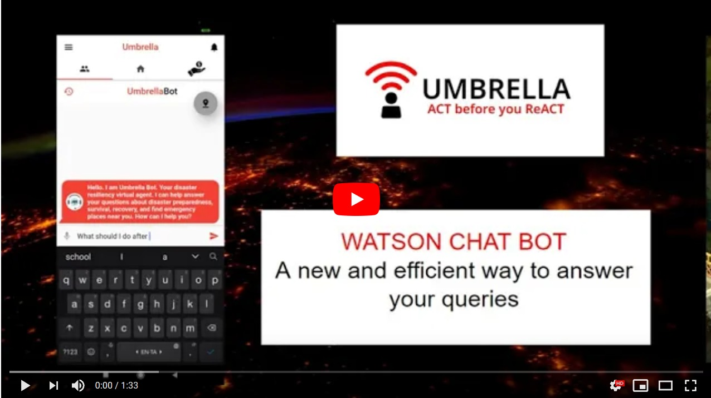

# PROJECT UMBRELLA
A user-friendly disaster resilience app that gives alerts to the users ahead of time and prepare them by recommends guidelines during a disaster.It connects the Disaster Management authority, rescue officers and the local users  for effective disaster management and risk prediction. 
## Contents

1. [Short description](#short-description)
1. [Demo video](#demo-video)
1. [The architecture](#the-architecture)
1. [Long description](#long-description)
1. [Project roadmap](#project-roadmap)
1. [Getting started](#getting-started)
1. [Running the tests](#running-the-tests)
1. [Live demo](#live-demo)
1. [Built with](#built-with)
1. [Author](#author)
1. [Feedback](#feedback)

## Short description

### What's the problem?

According to the World Health Organization, Natural disasters kill an estimated 90,000 people and affect close to 160 million people worldwide every year.Climatic change plays a significant role in this. Severe weather events in particular have increased in frequency and intensity over the past decade.Disasters like Floods, Cyclones, Hurricanes, Tornadoes and Forest fires are the threatening of all.
Every state has its own disaster management authority,to monitor and take emergency decisions related to the disaster in their state.However, during emergency situations like over flooding the state authorities make decisions like opening large water sources such as dams and lakes in order to avoid larger damage. Millions of people living near these water resources are affected.  The Poor communication with the local people due to shortage of time  is the major cause for most disastrous flood deaths.

### How can technology help?

Technology can help connect the Disaster Management Authorities with the Rescue Officials and Local people for better coordination and communication during the emergency times.It can also give alerts, guidelines and making them prepare well during the disaster times.By collecting data  

### The idea

Due to climate change, floods are becoming more frequent and more severe, leading to widespread issues for affected communities. Every state has its own disaster management authority to monitor and make decisions on emergency situation. It also has a disaster response force to rescue the affected people. Project umbrella aims to connect the localites with the response force and the state disaster management authority for reliable and efficient communication and coordination among them.This is done by creating different applications for the three different users.By using IBM watson ,Firebase and a couple of third party API services we can build a information rich Interface for the localite.This can be then connected with the response force application.With the information collected from the meteorological  department and other trusted sources we give risk predictions to the disaster management authority their decisions can now be communicated with the emergency response force and the localites at ease using push notifications.   


## Demo video

[](https://youtu.be/B3lem55SuNE)

## The architecture


1. The public user(Localite) interacts with the umbrella app.
2. The app uses the various third party APIs   
	i.   Open weather Map API to show location based  weather updates and predictions.
	ii.  News API to show realtime weather news and disaster updates
	iii. Razorpay to make dontaions using variety of payment options.  
3. Watson assistant that is trained to answer users questions on disaster preparedness and location based navigation to relief centers.
4. Firebase to use cloud functions and cloud messaging to show disaster alerts and emergency messages using push notifications.
5. Communication between Public users and rescue team.
6. The Disaster Response force user interacts with the Respose app to see pending rescue operations.
7. The State Disaster management authority authenticates and uses the Umbrella DMA web portal to see disaster alerts in their state.
8. The Node Server sends emergency alerts to the Umbrella user firebase function.
9. The Node Server recieves meteorological data and analytics from the meteorological department.
10. Node server to send emergency commands to the response app to perform emergency operation.
	
## Long description

[More detail is available here](DESCRIPTION.md)

## Project roadmap


## File Details

1. [Flutter user app source code](Umbrella-Apps/User_app/umbrella)
1. [Watson dialog skill](Server/skill-umbrella-bot-dialog-skill.json)
1. [App UI screenshots](screen-shots)

## Getting started

These instructions will get you a copy of the project up and running on your local machine. Follow the instructions to run the app on your phone or emulator.Note that the source code support android devices.However as per the road map the app can be deployed in IOS devcies in the future.

### Prerequisites

1. [Flutter SDK](https://flutter.dev/docs/get-started/install)
1. [Watson Assistant](https://www.ibm.com/in-en/cloud/watson-assistant)
1. [OpenWeatherMap API](https://openweathermap.org/api)
1. [Razorpay API](https://dashboard.razorpay.com/app/dashboard)
1. [News API](https://newsapi.org/)

### Installing

1. Install the flutter SDK and add it to you path

2. Register the above gievn API services and create a firebase account with a new project and paste the google-services.json file in the app directory

3. Activate the IBM watson assistant resource and import the dialog skill from the [Server](Server/skill-umbrella-bot-dialog-skill.json) folder.Make note of the API Key, Assistant ID and Assistant url.

4. goto the [secret.dart](umbrella/lib/secret.dart) and enter your API credentials

Run the following command in the terminal

```bash
flutter run
```
Try these in the umbrella bot session

1. What should I do during a cyclone?
2. Can I go out after flood?
3. A hurricane destroyed my home.Show me public shelters.
4. I'm hungry.Local shops are destroyed, Where can I find relief centers?
5. What is a wild fire?

## Live demo

Install the apk file from [here](https://drive.google.com/file/d/1twJmd0w-1ixiijQK6gILVTG_VNoOBJPi/view?usp=sharing) or see a detailed video on what a client side umbrella app can do [here](https://youtu.be/0l8P-3m9njU)

## Built with

### Umbrella user app
* [IBM Watson](https://www.ibm.com/in-en/cloud/watson-assistant) - To build the interactive chatbot
* [Firebase Cloud Functions](https://cloud.ibm.com/catalog?search=cloud%20functions#search_results) - To recieve data from the server and send it via FCM
* [Firebase Cloud Messaging](https://firebase.google.com/products/cloud-messaging?gclid=Cj0KCQjwgo_5BRDuARIsADDEntT36LgedgHS2eDUuQ_RI52la_ePy6SttLnhqPJ9E76jhw7aligHqrMaAitwEALw_wcB) - To send notification to the user
* [Razorpay](http://www.dropwizard.io/1.0.2/docs/) - A easy all in one payment gateway to make donations
* [Open-Weather-Map](https://maven.apache.org/) - A api used to perform location based weather analytics
* [News API](https://rometools.github.io/rome/) - To give weather and disaster related news update

## Authors

* **V Ram Kishan** - [Linkedin](https://www.linkedin.com/in/v-ram-kishan/)

## Feedback

Please fill this feedback [form](https://forms.gle/Zd9Z6KM2GQ84Bpp39) as it would help project umbrella evolve.

